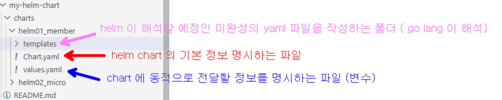
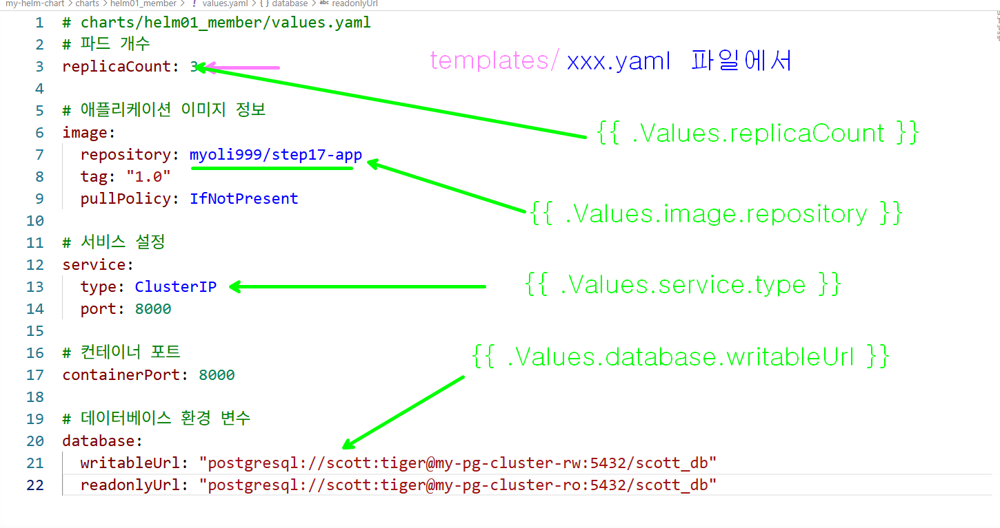

## 나만의 helm chart 를 만들고 github pages 로 배포 해보자 



### templates yaml 파일 작성법



### 작성한 chart 가 잘 실행되는지 확인해 보자


### 작성한 helm chart 소스 코드를 일단 github에 push 한다

```bash

git init
git add .
git commit -m "helm01_member 파일 추가"
git remote add origin git@[IP_ADDRESS]:my-helm-chart.git
git push 0u origin master

```